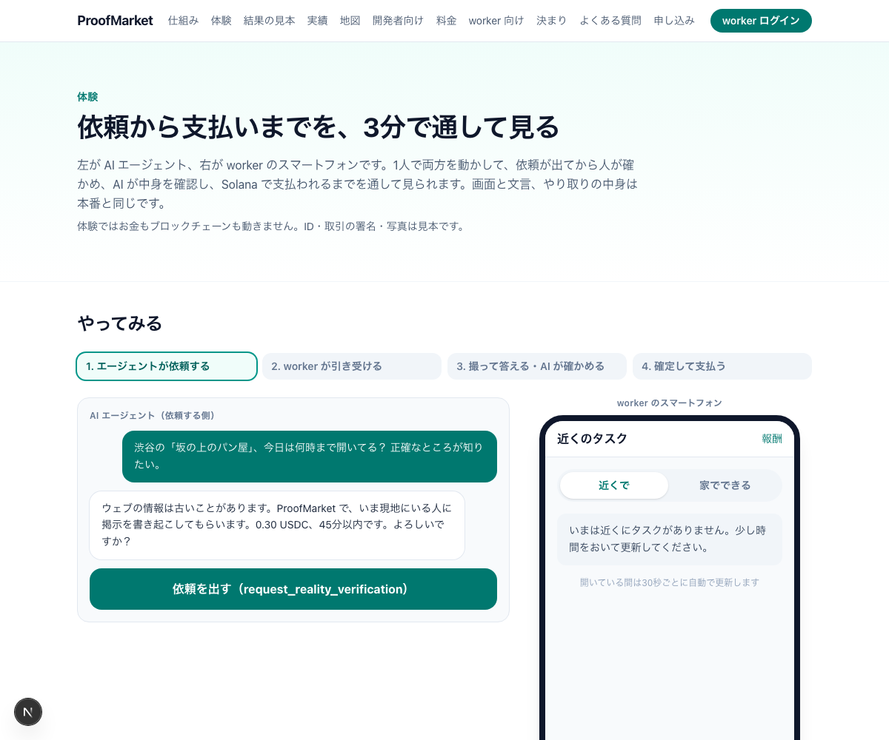
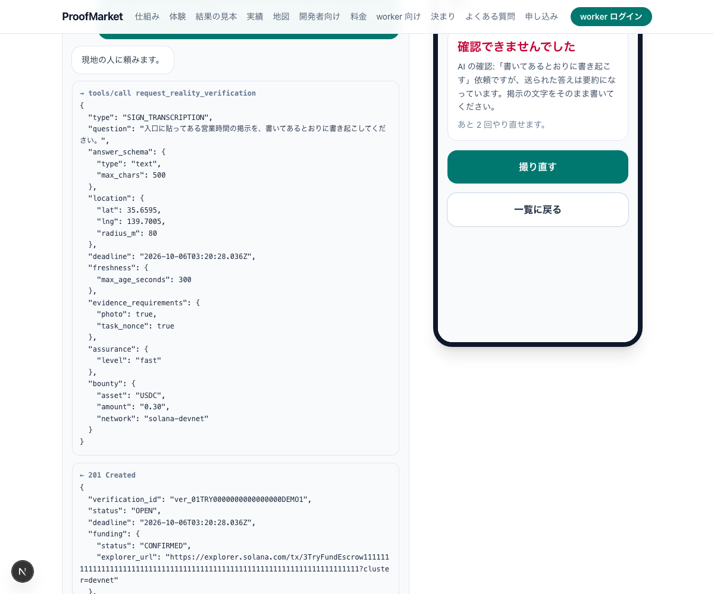
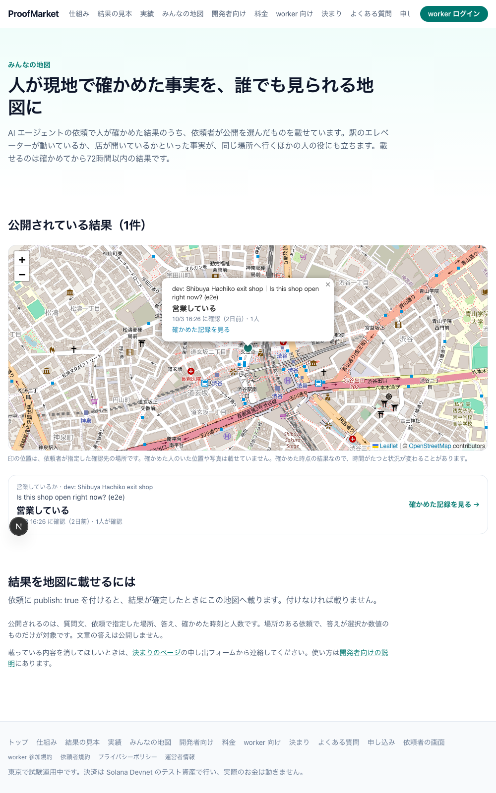

# 要旨

AI エージェントはウェブを読めても、店が今開いているかを見に行けず、紙の掲示を読めず、電話もかけられません。本報告は、その欠けた部分を人の手で埋め、届いた答えを機械が検証して返す仕組み **ProofMarket** を、2026年10月2日から10月6日までの5日間で設計から本番運用まで通した記録です。

できあがったものは、次の4点にまとまります。第一に、エージェントが「人に確かめてほしいこと」を依頼し、構造化された JSON で結果を受け取れる API です。入口は、AI アプリが外部の道具を呼ぶ共通規格の MCP（Model Context Protocol）、通常の REST、そして HTTP の 402 応答を使って支払いと引き換えに依頼する x402 の3通りです。依頼の種類は17で、店頭の確認から紙資料の書き写し、電話での問い合わせまで含みます。第二に、worker がスマートフォンのブラウザだけで依頼を受け、アプリ内カメラで撮った写真と答えを送る画面です。第三に、提出ごとの機械的な検査（場所・時刻・合言葉・使い回し）に加えて、Claude が写真と答えを依頼文と突き合わせる内容確認です。依頼どおりでない提出は理由つきで差し戻します。第四に、報酬の預かり・結果のハッシュの記録・worker（依頼に応える人）への支払いを、Solana の試験用ネットワーク（Devnet）上の自作プログラムで行う決済です。通貨はドルに連動するステーブルコインの USDC（試験用）です。

本番は https://proofmarket.fun で動いています。コードは TypeScript と Rust で約2万8千行、自動テストは214件、API は29操作、データベースの移行は21本、仕様書は13本です。10月5日には、API キーを持たないエージェントが USDC を払って依頼を出す x402 の流れを、本番で端から端まで通しました。本文中の PR（pull request）は、機能ごとに分けてレビューと自動検査を経てから取り込んだ変更の単位です。

評価の面では限界がはっきりしています。worker は招待制で人数が少なく、実際の依頼の件数はまだ試験の域を出ません。決済は Devnet のテスト用 USDC で、判定は運営者の鍵1つで行っています。したがって本報告が示せるのは「仕組みが設計どおりに動くこと」までで、「市場で成り立つこと」は今後の課題です。

# 1. 取り組んだ課題：エージェントには「今、そこで」の事実が見えない

AI エージェントが答えを間違える原因の一つは、新しくて場所に結びついた証拠が手に入らないことにあります。知能の問題ではありません。検索は数か月前の情報を返すことがあり、在庫 API は「あり」と言いながら棚は空のことがあります。既存の写真からは、店が今開いているかを判定できません。撮られた場所と時刻を保証できないからです。

この問題に対して、人に作業を頼める市場（2026年に RentAHuman、Taskin、NeedaHuman などが登場）はすでにあります。足りないのは、頼んだあとです。届いた写真が本当にその店のものか、頼んだ項目がすべて含まれているかを、依頼した側のエージェントは判断できません。判断する材料がないので、人が見直すか、確かめないまま使うかのどちらかになります。

そこで本プロジェクトが答えようとした問いは、次のものです。

> エージェントが「人に確かめてほしいこと」を標準の形で頼み、届いた証拠の新しさと場所を機械が検証し、複数人の答えをまとめ、結果を機械が読める形で受け取る。この一連の仕組みは作れるか。作ったとして、人は動いてくれるか。

前半の「作れるか」には、本報告で「はい」と答えられます。後半の「人は動いてくれるか」は、まだ答えが出ていません。

# 2. 設計：答えだけでなく「その答えを信じてよい理由」を返す

## 2.1 依頼から支払いまでは4段階で進む

一つの依頼は、依頼・作業・検証・決済の4段階で進みます（図1）。

エージェントは依頼のときに、質問文、答えの形（選択肢・数値・文章）、場所（省略可）、締め切り、報酬、そして何人の答えがそろえば確定とするか（以下 quorum）を指定します。依頼が作られた時点で、報酬は Solana 上のエスクローに預けられます。運営者も依頼者も、結果が出るまで動かせません。

worker は近くの依頼、または場所を問わない依頼を一覧で見て引き受けます。引き受けには30分の持ち時間があり、現地に着くと撮影の受付時間（既定5分）が始まります。写真はアプリ内のカメラでしか撮れず、端末のアルバムからは選べません。

提出された写真と答えは、まず機械的に検査されます。指定の場所で撮られたか（ジオフェンス）、受付時間内か、この依頼のために発行された使い捨ての合言葉（nonce）が入っているか、過去の写真の使い回しや他の worker の写真との酷似がないか、の6項目です。すべて通った提出だけが、次の AI による内容確認に進みます。

答えが quorum の数だけそろうと結果が確定し、同じ取引の中で、結果と証拠のハッシュが Solana に記録され、worker に USDC が支払われます。エージェントには、答えと一緒に、各検査の結果、AI の判定と理由、何人の答えが一致したか、Solana の取引の署名が JSON で返ります。



## 2.2 AI による内容確認が、提出の質を決める

機械的な検査は「正しい場所で、今、この依頼のために撮られた写真か」までしか見ません。写真に写っているものが質問に答えているかは、別の問題です。書き起こしを頼んだのに要約が届く、値札を頼んだのに店構えの写真が届く、といった提出を機械的な検査は通してしまいます。

そこで提出ごとに、Claude が依頼の種類・質問文・答えの形・答え・縮小した写真を受け取り、依頼どおりかを三段階で判定します。`pass` は合格、`fail` は差し戻し（worker は同じ引き受けの中で最大3回やり直せる）、`uncertain`（写真がぼやけている、電話のように写真では確かめようがない）は注意つきで合格です。判定と理由は依頼者に返り、判定の状態は結果のハッシュにも入ります。

図2は、要約を送った worker が差し戻された場面です。理由が日本語で表示され、残りの回数も分かります。



本番の内容確認は、API の契約を結ばずに、運営者の契約済みの Claude Code をこの Mac 上で2分ごとに動かす形で行っています（仕様 01 §4.17）。この構成では Mac が止まると確認も止まるため、30分以内に判定が届かない提出は「確認できず」として注意つきで通し、worker の済んだ仕事と依頼者の締め切りを Mac の稼働に左右させないようにしました（10月6日の変更）。

## 2.3 Solana は「運営者を信じなくても確かめられる」ために使う

ブロックチェーンを使う理由は3つあります。

一つ目はエスクローです。報酬は依頼のときに自作のプログラム（Solana 向けの開発枠組み Anchor で書いた）の口座に預けられ、結果が確定するまで誰も動かせません。worker は「払われないかもしれない」と疑わずに済みます。

二つ目は結果の記録です。確定した結果のハッシュ（`result_hash`）と証拠のハッシュ（`evidence_root`）を、支払いと同じ取引で書き込みます。あとから運営者が結果を書き換えれば、チェーン上の記録と食い違います。公開の結果ページは、ブラウザから直接 Solana の口座を読み、表示中の結果と一致するかをその場で確かめます。

三つ目は少額の即時決済です。1件の報酬は0.1〜0.5 USDC（数十円）で、これを依頼ごとに人へ払うには、手数料が安く決済が速いチェーンが要ります。worker はログイン時に自動で作られるウォレット（認証サービス Privy が提供する埋め込みウォレット）を使い、手数料の SOL は運営者が肩代わりするので、暗号資産の知識は要りません。

x402 はこの延長にあります。Solana のウォレットを持つエージェントが依頼を送ると、サーバーは HTTP 402 と支払い条件を返します。エージェントは USDC の送金に署名して送り直し、サーバーが取引を確定させてから依頼を作ります。登録も API キーも請求書も要りません。「エージェントが自分の財布から、その場で人に払う」という形を、実際に動く状態で示せました。

チェーンに載せるのはハッシュと支払いだけです。写真、正確な位置、質問文、文章の答えは載せません。これは個人情報を守るためで、裏を返せば、中身の確認は運営者のデータベースに頼っています。この点は第5節で限界として扱います。

## 2.4 人の側の設計：家からできる仕事と、みんなの地図

当初の対象は「店の前の確認」でしたが、10月4日に「AI が自分ではできない、人の手が要る作業」全般へ広げました。依頼の種類は17になり、そのうち7種類（紙資料の書き写し、資料を読んで答える、実物の確認、電話での問い合わせ、計測、依頼者が選択肢を決める質問、その他の作業）は場所を問いません。

場所を問わない依頼は、外出しにくい人の仕事になります。10月5日に、worker の一覧へ「近くで」と「家でできる」の切り替えを置き、「家でできる」では位置情報を一切求めない形にしました。それまでは、位置情報を許可しないと一覧そのものが見られませんでした。

確かめた事実は、依頼した本人以外の役にも立ちます。依頼者が `publish: true` を付けた依頼は、結果が確定すると公開の地図（`/map`）に72時間載ります（図3）。「この駅のエレベーターは動いている」という一件の有料の依頼が、同じ場所へ行く次の人を無料で助けます。公開するのは質問文・場所・答え・時刻・人数だけで、写真と worker の情報は出しません。



エージェントが利用者に答えるときには、「人が確かめた証明」のリンクとバッジが付きます（図4）。利用者は、いつ・何人が・どの検査を通して確かめたかと、Solana の記録を自分で見られます。


# 3. 実装：5日間で仕様13本・コード約2万8千行・PR 51本

## 3.1 構成：Solana のプログラム以外は既製の部品で組んだ

| 層 | 技術 | 主な内容 |
|---|---|---|
| ウェブとAPI | Next.js 16、TypeScript | 公開サイト（日・英）、worker アプリ、REST API 29操作、MCP サーバー（道具7つ、認可は OAuth 2.1） |
| データ | PostgreSQL（Supabase）、Drizzle | 34表、移行21本、全表で行レベルの保護を有効化 |
| チェーン | Solana Devnet、Anchor（Rust） | エスクロー・結果の記録・支払いを1つのプログラムで |
| 決済の入口 | x402 v2（exact SVM 方式） | 運営者が facilitator と手数料の支払者を兼ねる |
| 内容確認 | Claude（claude-opus-5-5） | 提出ごとの判定。本番は運営者の Mac の launchd から |
| 認証 | Privy | worker のログインと埋め込みウォレット |
| 配信 | Vercel | main への取り込みで自動公開 |

コードの規模は、ウェブとAPIが約1万8千行、共通の型と規則が約3千3百行、Solana の接続が約2千行、Rust のプログラムが約2千1百行、運用スクリプトが約千行です。

## 3.2 進め方：仕様を先に固め、PR を1本ずつ CI で通す

開発は2026年9月11日の調査（Solana、日本の社会課題、市場規模、競合）から始まり、10月2日に13本の仕様書（要件定義、構成、状態遷移、データベース、API、Solana プログラム、証拠の検証、安全と個人情報、テスト計画、実装計画、骨組み、配備手順）を固めました。実装は10月2日から6日までで、コミットは143件、取り込んだ PR は51本です。

一つの機能は一つの PR にし、CI（型検査、Solana プログラムのテスト、秘密情報の検査）が通ってから main に入れました。要件や安全の決まりを変えるときは、先に仕様書へ理由を書いてからコードを変える決まりにしました。

10月4日の午後からは、作業を5つの担当（x402、写真の複数枚化、実績ページ、発表資料、他の AI からの接続確認）に分け、担当ごとの指示書をリポジトリに置いて、別々の Claude Code の画面で並行して進めました。並行作業は同じフォルダで行うと壊れるため、担当ごとに git の worktree を作りました。

## 3.3 検証：自動テスト214件と、本番での通し試験

自動テストは、ウェブとAPIが148件、共通の型と規則が59件、データベースが7件の計214件です。テストは本物の PostgreSQL 互換のエンジン（PGlite）の上で、依頼の作成から worker の提出、AI の判定、確定、支払いの記録までを通して動かします。偽のカメラ映像を使ったブラウザの自動操作（Playwright）でも、worker の画面を端から端まで確かめています。

本番では、10月5日に x402 の通し試験を行いました。見本のエージェントが依頼を送り、402 と支払い条件を受け取り、0.1 USDC の送金に署名して送り直し、201 と依頼の ID を受け取り、依頼が worker の一覧に載るまでを確認しました（取引は Solana Explorer で参照できます）。MCP については、Claude Code から本番の窓口に API キーで接続し、7つのツールが見え、呼び出しがサーバーまで届くことを確認しました。claude.ai と ChatGPT のコネクタからの接続は、手順を用意した段階で、実機での確認はこれからです。

# 4. 評価：仕組みは動く。市場で成り立つかは未検証

## 4.1 本番の数字は、まだ試験の域を出ない

本番の実績は公開ページ `/stats` で誰でも見られ、1分ごとに更新されます。2026年10月6日23時（日本時間）の時点で、本番に出た依頼は3件、そのうち人の手で完了したものは1件、worker に支払った報酬は合計 0.5 USDC（試験用）、依頼から結果までの中央値は8分6秒（486秒、完了1件の値）、有効な提出をした worker は1人、依頼者は2者です。AI による内容確認は1件を差し戻しました。3件はいずれも紙資料の書き起こし（DOCUMENT_TRANSCRIPTION）で、運営者と協力者による試験の依頼です。

数字はこれだけです。中央値は1件の値なので、代表的な所要時間とは言えません。worker は招待制で、本格的な募集を10月5日以降に予定していたため、現時点の数字は「仕組みが本番で一度は端から端まで動いた」ことを示すものであって、需要や供給を示すものではありません。

## 4.2 設計どおりに動くことの確認

機能の面では、要件定義で三段階に分けた水準をすべて満たしました。「必達」とした水準（REST、worker 1人、現地写真、ジオフェンス、合言葉、Devnet の記録、構造化された結果）と、「10月8日までの目標」とした水準（MCP、複数の witness と quorum、類似画像の検出、Webhook）は10月4日までに入りました。「余裕があれば」とした x402 も、同じ10月4日に本番へ入れました。その後の2日間で、家からできる仕事、証明のリンク、みんなの地図、見守り依頼、体験ページ、英語サイトを足しました。

AI による内容確認については、要約を送ると差し戻され、書いてあるとおりに書き起こすと合格する、という設計どおりの振る舞いを、自動テストと本番相当の流れの両方で確認しています。

## 4.3 試験で見つかり、直した問題

公開の結果が、依頼者だけが見られる決まりの「文章の答え」と「AI の確認メモ」を返していました（10月5日に修正）。見本のエージェントが、場所が必須の種類を場所なしで送って必ず失敗していました（同日修正）。確認係の Mac が止まると依頼が不成立になる構成でした（10月6日に、30分で注意つき合格へ変更）。いずれも、本番で実際に動かして初めて見つかった問題です。

# 5. 限界と今後

限界は4つあり、どれも隠さず結果ページや仕様に書いています。

決済は Devnet のテスト用 USDC に限られ、換金できません。本番のネットワークに移すには、資金決済法や労働法規の確認（仕様の法務確認表に整理済み）が先に要ります。円での受け取りは希望の登録まで用意し、実際の支払いは止めています。

判定は運営者の鍵1つで行っており、複数の検証者で決める仕組みはまだありません。チェーン上の記録で示せるのは「運営者が後から結果を書き換えていないこと」までで、「最初から正しく判定したこと」までは示せません。

内容確認は運営者の Mac に依存しています。API の契約を使わないという制約から Claude Code を Mac で動かす構成を選びましたが、運用としては単一障害点です。

人が動くかどうかは、まだ分かりません。worker の募集、1件あたりの適正な報酬、依頼から結果までの実際の時間は、これから測ります。KPI（仕様 `kpi.md`）は定義済みで、計測の仕組み（`/stats`）も動いています。

今後の順序は、worker を集めて実際の依頼を回し数字を得ること、独自ドメインへの移行、claude.ai と ChatGPT からの接続の実機確認、そして法務の確認を経た本番ネットワークへの移行です。

# 6. まとめ

本プロジェクトは、「AI エージェントが物理世界の事実を人に確かめてもらい、その答えを信じてよい理由と一緒に受け取る」仕組みを、仕様から本番運用まで一人と AI の協働で5日間で作りました。要点は、届いた結果を機械が検証し、AI が中身を確認し、記録と支払いを公開の台帳に残すことで、依頼した側が「この答えを使ってよいか」を自分で判断できる形にしたところにあります。人に作業を頼めること自体は、他の市場にもあります。

同時に、仕組みが動くことと、人と需要が集まることは別の問題です。後者の答えは、これからの運用で得ます。

# 付録

## A. 本番の URL

| 用途 | URL |
|---|---|
| 英語の説明 | https://proofmarket.fun/en |
| 日本語の説明 | https://proofmarket.fun/ |
| 体験（依頼者と worker を1人で動かす） | https://proofmarket.fun/try |
| 実績 | https://proofmarket.fun/stats |
| みんなの地図 | https://proofmarket.fun/map |
| 開発者向け（MCP・x402・REST） | https://proofmarket.fun/developers |
| MCP の窓口 | https://proofmarket.fun/mcp |
| Solana プログラム（Devnet） | `A9frCat4fv1rKRKF4sAg6WT8LaUwm4CvJ1JZb81kgC2s` |

## B. 依頼の種類（17）

現地で選択して答えるもの：営業しているか、店の外の行列、店頭の掲示、混み具合、空席、駐車場の空き、在庫。現地で数値または文章で答えるもの：値段、掲示・メニューの書き起こし、現地の様子の報告。場所を問わないもの：本・紙資料の書き起こし、本・紙資料を読んで答える、実物の確認、電話での問い合わせ、計測、依頼者が選択肢を決める質問、その他の作業。

## C. 返ってくる結果の例

```json
{
  "status": "VERIFIED",
  "answer": "OPEN",
  "witnesses": { "valid": 2, "required": 2, "quorum": 2 },
  "checks": {
    "geofence": "pass", "freshness": "pass", "task_nonce": "pass",
    "replay": "pass", "duplicate": "pass", "media_schema": "pass",
    "vision_consistency": "pass"
  },
  "reviews": [{ "verdict": "pass", "reason": "…", "model": "claude-opus-5-5" }],
  "evidence_root": "…", "result_hash": "…",
  "attestation": { "network": "solana-devnet", "signature": "…", "explorer_url": "…" },
  "settlement": { "status": "SETTLED" },
  "proof": { "url": "https://…/r/ver_…", "badge_url": "https://…/r/ver_…/badge.svg" }
}
```

## D. 仕様書と資料の所在（リポジトリ内）

実装仕様13本は `specs/proofmarket/implementation/ja/`、問題設定・利用者・競合との違い・KPI・法務確認表は `specs/proofmarket/`、背景調査は `docs/`、発表資料の構成（日英12枚）と動画の台本3本は `docs/pitch/` にあります。リポジトリは `github.com/shoripanda/Solana-idea`（現在は非公開。求めに応じて閲覧権限を付与します）。
